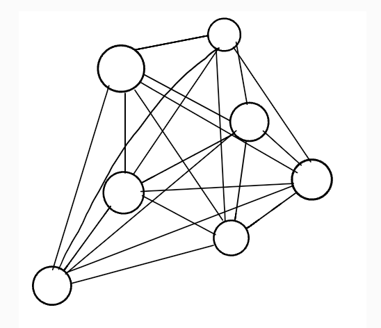
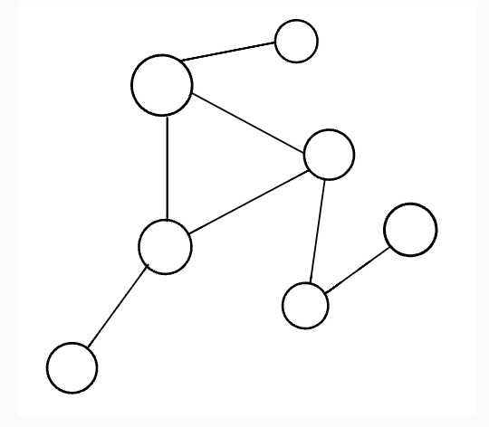
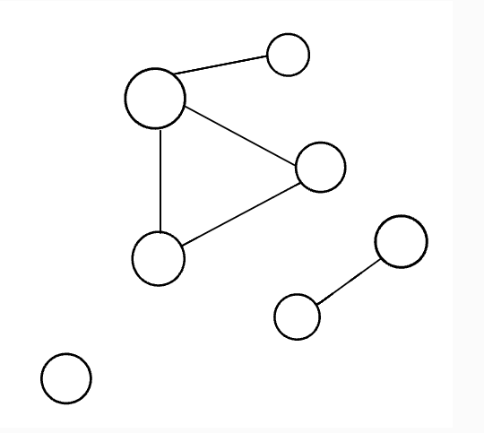

# Graphs : 
- A graph is a non-linear data structure that can be looked at as a collection of vertices (or nodes) potentially connected by line segments named edges.

### common terminology used when working with Graphs:
- Vertex - A vertex, also called a “node”, is a data object that can have zero or more adjacent vertices.
- Edge - An edge is a connection between two nodes.
- Neighbor - The neighbors of a node are its adjacent nodes, i.e., are connected via an edge.
- Degree - The degree of a vertex is the number of edges connected to that vertex.

### Directed vs Undirected
- Undirected Graphs
  - An Undirected Graph is a graph where each edge is undirected or bi-directional. This means that the undirected graph does not move in any direction.

- Directed Graphs (Digraph)
  - A Directed Graph also called a Digraph is a graph where every edge is directed. Unlike an undirected graph, a Digraph has direction. Each node is directed at another node with a specific requirement of what node should be referenced next.

### Complete vs Connected vs Disconnected: 

- CompleteGraphs:  
    
  
- Connected :   
    
  
- Disconnected :  
  

### Acyclic vs Cyclic
- Acyclic Graph
  - An acyclic graph is a directed graph without cycles.

  - A cycle is when a node can be traversed through and potentially end up back at itself.

- Cyclic Graphs
  - A Cyclic graph is a graph that has cycles.

  - A cycle is defined as a path of a positive length that starts and ends at the same vertex.